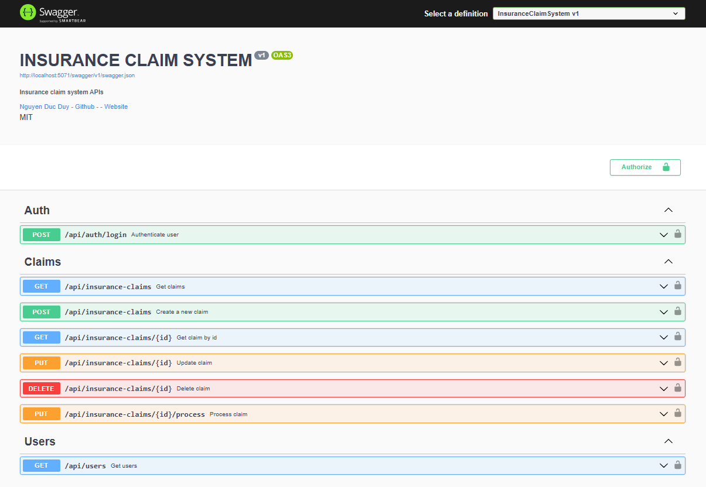
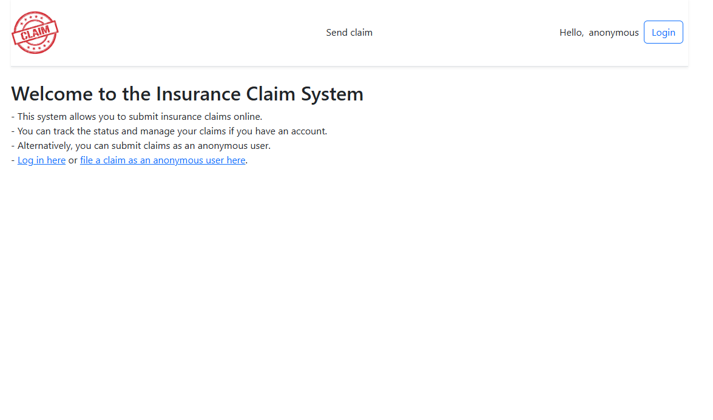
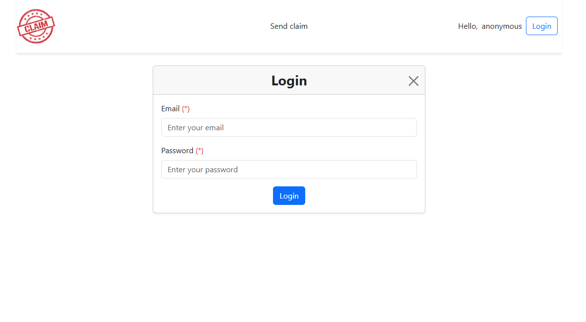
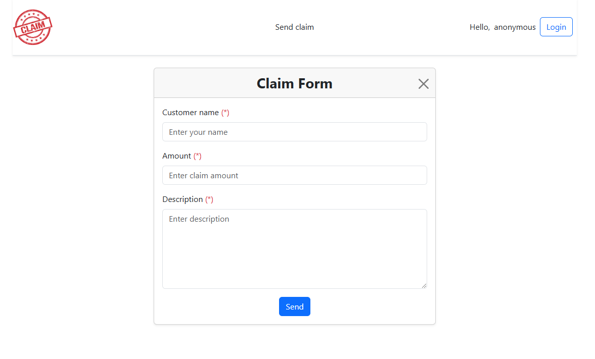
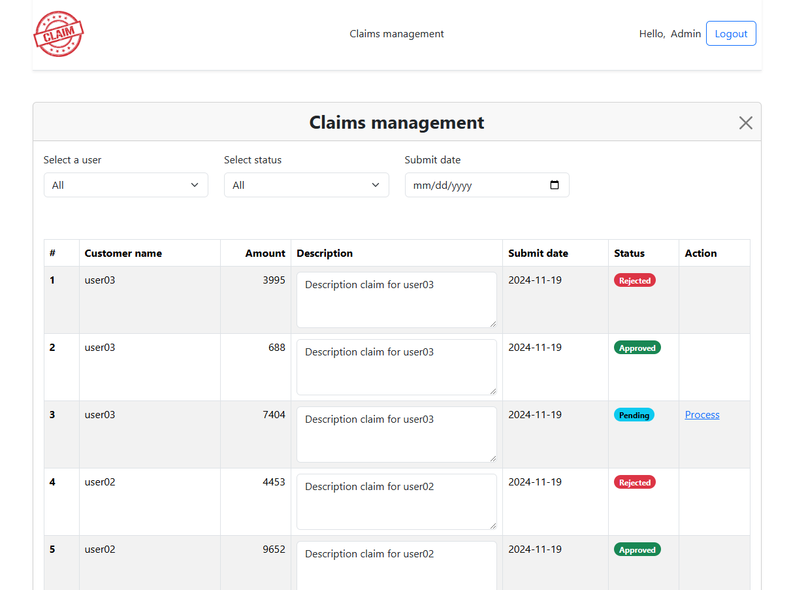

# Insurance Management System

# Table of Contents

- [About](#about)
  - [User Account](#user-account)
- [System Design and Analysis](#system-design-and-analysis)
  - [Features](#features)
  - [User Roles and Stories](#user-roles-and-stories)
  - [Database Design](#database-design)
- [Technologies](#technologies)
- [How to Run This Project](#how-to-run-this-project)
  - [Prerequisites](#prerequisites)
  - [Steps](#steps)
    - [1. Clone the repository](#1-clone-the-repository)
    - [2. Run the Back-End API](#2-run-the-back-end-api)
    - [3. Run the Front-End Application](#3-run-the-front-end-application)
- [API Documentation](#api-documentation)
  - [Auth](#auth)
  - [Claims](#claims)
  - [Users](#users)
- [Testing](#testing)
- [Code Structure and Design](#code-structure-and-design)
  - [Key Design Principles](#key-design-principles)
    - [RESTful API Design](#restful-api-design)
    - [Service Layer](#service-layer)
    - [Repository Pattern](#repository-pattern)
  - [Folder Structure](#folder-structure)
- [Challenges and Decisions](#challenges-and-decisions)
- [Screenshot](#screenshot)

# About

Full-stack Developer Technical Assessment

### User Account

| Email              | Password    | Role  | Description |
| :----------------- | :---------- | :---- | :---------- |
| `admin@gmail.com`  | `Admin@123` | admin | Admin user  |
| `user01@gmail.com` | `User@123`  | user  | Member user |
| `user02@gmail.com` | `User@123`  | user  | Member user |
| `user03@gmail.com` | `User@123`  | user  | Member user |

# System Design and Analysis

## Features

This system provides the following functionalities:

- Allows users to submit insurance claims online.
- Enables users with an account to track the status and manage their claims.
- Supports anonymous claim submissions for users without an account.
- Processes claims with a 50/50 chance of approval or rejection.

## User Roles and Stories

### Anonymous User

- Submit an insurance claim online.
- Check the status of their submitted claim.

### Member User

- Log in to the system.
- Submit an insurance claim online.
- View and manage their claim history.
- Edit or delete a claim if it has not been processed yet.

### Admin User

- Log in to the system.
- View and manage all claims in the system.
- Process a claim with a 50/50 chance of approval or rejection.

## Database Design

### Claim Table

| Column Name  | Data Type      | Constraints                       | Description                                                |
| :----------- | :------------- | :-------------------------------- | :--------------------------------------------------------- |
| Id           | GUID           | Primary Key, Auto-Generate        | Id of the claim                                            |
| CustomerName | NVARCHAR(50)   | Not Null                          | Customer name that file the claim                          |
| Amount       | DECIMAL(18, 2) | Not Null, Min 0.0, Max 2147483647 | Amount of the claim                                        |
| Description  | NVARCHAR(255)  | Not Null                          | Description of the claim                                   |
| SubmitDate   | DATETIME       | Not Null                          | Submit date of the claim                                   |
| Status       | NVARCHAR(20)   | Not Null                          | Status of the claim (0: Pending, 1: Approved, 2; Rejected) |
| UserId       | NVARCHAR(100)  | Nullable                          | Id of the user that file the claim                         |

# Technologies

- Back-end: C# with .NET Core (.NET 8)
  - Entity Framework Core
  - Identity Entity Framework Core
  - Authentication JwtBearer
  - Auto Mapper
- Database: In-memory database
- Front-end: HTML, CSS, JavaScript
  - jQuery
  - Bootstrap
  - Jquery Validation

# How to Run This Project

## Prerequisites

- Install .NET 8 SDK

## Steps

### 1. Clone the repository

```
git clone https://github.com/duynguyen224/insurance-claim-system.git
```

### 2. Run the Back-End API

- Go to BE directory

```
cd .\insurance-claim-system\
cd .\BE\
```

- Restore dependencies

```
dotnet restore
```

- Start the project

```
dotnet run --project InsuranceClaimSystem
```

After that

- The API will be available at: <a href="http://localhost:5071" target="_blank">http://localhost:5071</a>
- You can see the API documentation in <a href="http://localhost:5071/swagger/index.html" target="_blank">http://localhost:5071/swagger/index.html</a>

### 3. Run the Front-End Application

- Open the /FE/pages/index.html file in a browser.
- Ensure the back-end API is running for full functionality.

> [!NOTE]
> Make sure to match your API port with BASE_URL in `/FE/js/common.js` in the FE project

> `const BASE_URL = "http://localhost:5071/"; // /FE/js/common.js // Edit with your API port`

# API Documentation

> [!NOTE]
> Make sure Back-End API is running<br>
> Change the port with your API port<br>
> http://localhost:<5071>/swagger/index.html

Swagger UI: <a href="http://localhost:5071/swagger/index.html" target="_blank">http://localhost:5071/swagger/index.html</a>

### Auth

| Method | URL             | Description   | Use by    |
| :----: | :-------------- | :------------ | :-------- |
|  POST  | /api/auth/login | Login an user | anonymous |

### Claims

| Method | URL                      | Description              | Use by                 |
| :----: | :----------------------- | :----------------------- | :--------------------- |
|  GET   | /api/claims              | Retrieve all claims      | user, admin            |
|  GET   | /api/claims/{id}         | Retrieve a claim #id     | anonymous, user, admin |
|  POST  | /api/claims              | Create a new claim       | anonymous, user        |
|  PUT   | /api/claims/{id}         | Update data in claim #id | user                   |
|  PUT   | /api/claims/{id}/process | Process a claim #id      | admin                  |
| DELETE | /api/claims/{id}         | Delete a claim #id       | user                   |

### Users

| Method | URL        | Description        | Use by |
| :----: | :--------- | :----------------- | :----- |
|  GET   | /api/users | Retrieve all users | admin  |

# Testing

As I am not yet familiar with writing unit tests, I chose to manually test the system to ensure its functionality and reliability.

Since unit testing was outside my expertise, I dedicated my time to developing the optional front-end application to enhance the overall project and demonstrate additional skills.

As a next step, I plan to:

- Learn how to write unit tests using testing frameworks like xUnit and MSTest.
- Integrate unit tests and integration tests into my workflow for future projects to ensure robust and scalable systems.

# Code Structure and Design

The project follows the principles of clean architecture with a clear separation of concerns, even though all components are organized within a single project. This approach keeps the structure simple and manageable.

## Key Design Principles

### RESTful API Design:

- The API is designed following RESTful conventions to provide consistency and ease of use.
- Example routes:
  - `GET /api/claims?status={status}` – Retrieve claims filtered by status.
  - `POST /api/claims` – Submit a new claim.
  - `PUT /api/claims/{id}/process` – Process a claim (approve or reject).
  - `DELETE /api/claims/{id}` – Delete a claim

### Service Layer

- Encapsulates the business logic in service classes, ensuring the controllers remain lightweight and focused on handling HTTP requests.
- Interfaces define contracts, and concrete implementations handle logic.
- Example:
  - **Interface**: IClaimService
  - **Concrete Implementation**: ClaimService

### Repository Pattern

- Data access logic is abstracted into repository classes, adhering to the single-responsibility principle.
- Interfaces define database access contracts, while concrete implementations handle the operations.
- Example:
  - **Interface**: IClaimRepository
  - **Concrete Implementation**: ClaimRepository

## Folder Structure

Within the single project, the components are logically grouped into folders:

- **Controllers**: Handle API routing and HTTP request/response processing.
- **Services**: Contain the business logic and interact with repositories to fulfill API requests.
- **Repositories**: Handle data access operations, abstracting database interactions.
- **Models**: Define the entity data model.
- **DTOs**: Define the data transfer objects for request and response models.
- **Extensions**: Contains extension methods to simplify or enhance existing functionality.
- **Data**: Handles the database setup and configurations, including the DbContext class.
- **Mappings**: Contains mapper profiles to map between domain models and DTOs.
- **Middlewares**: Handles global error, logging, ...

# Screenshot

## Back-End

1. Swagger UI
   

## Front-End

1. Home Page
   

1. Login
   

1. Claim Form
   

1. Claim Management
   
